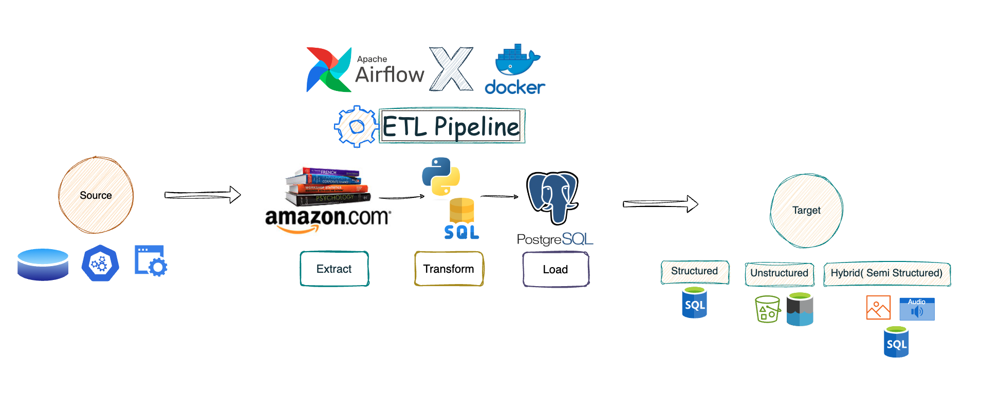

# Amazon Books Data Pipeline 
-----------

## Create a virtual environment and activate it (optional)
"""

    python -m venv venv
    source venv/bin/activate

"""

# 🔗Important links and Code
-----

## Install Airflow 
-----

Follow steps in the link - https://airflow.apache.org/docs/apache-airflow/stable/howto/docker-compose/index.html

## Install PGAdmin 
-----
Code to add in yaml file 

"""
    
    pgadmin:

        container_name: pgadmin4_container2
        
        image: dpage/pgadmin4
        
        restart: always
        
        environment:
        
          PGADMIN_DEFAULT_EMAIL: admin@admin.com
          PGADMIN_DEFAULT_PASSWORD: root
          
        ports:
          - "5050:80"
"""

-----

# Pipeline Design

-----
-----

# ⬇️Watch this video to Implement this Project from Scratch

      

